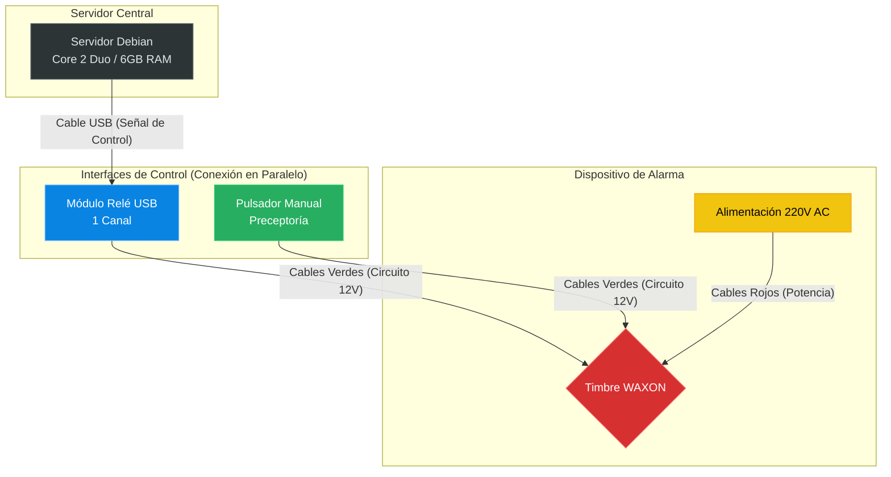

# Sistema de Automatización de Timbre Escolar 🔔

Este proyecto tiene como objetivo la automatización del timbre de una institución educativa para señalizar el inicio y fin de las jornadas de clases y los periodos de recreo. El sistema utiliza un servidor centralizado con Debian para gestionar los horarios y activar físicamente el timbre mediante un módulo de relé USB.

## 🎯 Intención del Proyecto
Proporcionar una interfaz web sencilla y robusta que permita al personal administrativo programar los horarios escolares. El servidor Debian procesa esta programación y envía señales precisas a un relé, eliminando la necesidad de activación manual y garantizando la puntualidad en toda la escuela.

## 🖥️ Características del Servidor (Debian)

### Hardware
*   **Modelo de CPU:** Intel(R) Core(TM)2 Duo CPU E7400 @ 2.80GHz (2 núcleos).
*   **Memoria RAM:** ~6 GB.
*   **Almacenamiento:**
    *   Unidad Principal: 112 GB (SSD/HDD para el Sistema Operativo).
    *   Unidad Secundaria: 300 GB (HDD `sda` disponible para almacenamiento masivo/backups).
*   **Conectividad:** Integrado en red privada mediante **Tailscale** (IP: `100.89.164.110`).

### Software
*   **Sistema Operativo:** Debian GNU/Linux 13 (Trixie).
*   **Kernel:** 6.12.74-2-amd64.
*   **Entorno de Aplicación:** Python 3.x con Flask para la interfaz web y APScheduler para la gestión de tareas programadas.

## 🔌 Especificaciones del Timbre (WAXON)
El dispositivo de salida es un timbre campana industrial con las siguientes especificaciones técnicas:
*   **Marca:** WAXON.
*   **Alimentación Principal:** 220V ~ 50Hz, 160mA (Cables Rojos).
*   **Circuito de Disparo (Pulsador):** 12V ~ (Cables Verdes).
*   **Modo de Activación:** Contacto seco sobre los cables verdes.

## 🎛️ Módulo Relé USB (LCUS-1 / CH340)
Para la interfaz entre la lógica del servidor y la potencia del timbre, se utiliza un módulo relé USB de 1 canal:
*   **Modelo:** LCUS-1 (Basado en el chip serial CH340).
*   **Función:** Actúa como un interruptor electrónico controlado por comandos seriales.
*   **Conexión:** Se identifica como un puerto COM (Windows) o `/dev/ttyUSBx` (Linux).
*   **Protocolo:** Comunicación serial a 9600 baudios mediante comandos hexadecimales:
    *   **Encendido:** `A0 01 01 A2`
    *   **Apagado:** `A0 01 00 A1`
*   **Configuración:** El puerto se puede configurar mediante la variable de entorno `RELAY_PORT`. Por defecto usa `COM3` en Windows y `/dev/ttyUSB0` en Linux.
*   **Cableado:** Conectar los cables verdes del timbre a los terminales **COM** (centro) y **NO** (derecha) del relé.

## ⚙️ Archivo de Configuración (`config.json`)

El archivo `timbre-escolar/config.json` contiene toda la programación del sistema:

```json
{
    "duracion_por_defecto": 5,
    "horarios": [
        { "hora": "07:30", "etiqueta": "Ingreso Turno Mañana", "duracion": 5 },
        ...
    ],
    "dias_sin_timbre": [
        { "fecha": "2026-05-25", "motivo": "Día de la Revolución de Mayo" },
        ...
    ]
}
```

### Horarios
Cada entrada define una hora (HH:MM), una etiqueta descriptiva y la duración del sonido en segundos. Se ejecutan automáticamente de lunes a viernes.

### Días sin Timbre
Lista de fechas donde el timbre **no** se activa, incluyendo feriados nacionales y jornadas especiales. Los fines de semana se excluyen automáticamente.

## 🚀 Instalación en Debian

```bash
# 1. Clonar el repositorio
git clone https://github.com/GustavoDago/alarma-eest-n3.git
cd alarma-eest-n3

# 2. Ejecutar el instalador
chmod +x setup_debian.sh
./setup_debian.sh

# 3. Cerrar sesión y volver a entrar (permisos del relé)

# 4. Iniciar el servicio
sudo systemctl start timbre-escolar
```

## 📋 Comandos Útiles

| Comando | Descripción |
|---------|-------------|
| `sudo systemctl status timbre-escolar` | Ver estado del servicio |
| `sudo systemctl restart timbre-escolar` | Reiniciar el servicio |
| `sudo systemctl stop timbre-escolar` | Detener el servicio |
| `journalctl -u timbre-escolar -f` | Ver logs en tiempo real |

## 🔧 Pruebas de Hardware

Antes de realizar la instalación completa, se puede verificar el relé:

```bash
# En Debian / Linux
python3 test_relay.py

# En Windows (PowerShell)
.\test_relay.ps1
```

Deberías escuchar dos "clicks" del relé. Verificá que el LED rojo de la placa se encienda y apague.

## 📊 Diagrama de Instalación



---
*Este documento fue generado automáticamente basado en las especificaciones técnicas del entorno y los requerimientos del usuario.*
